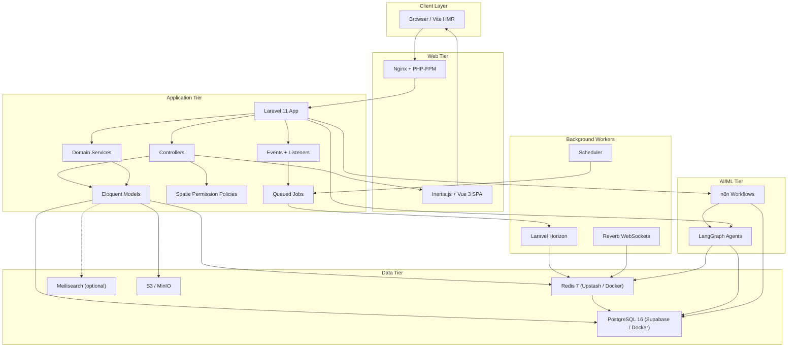
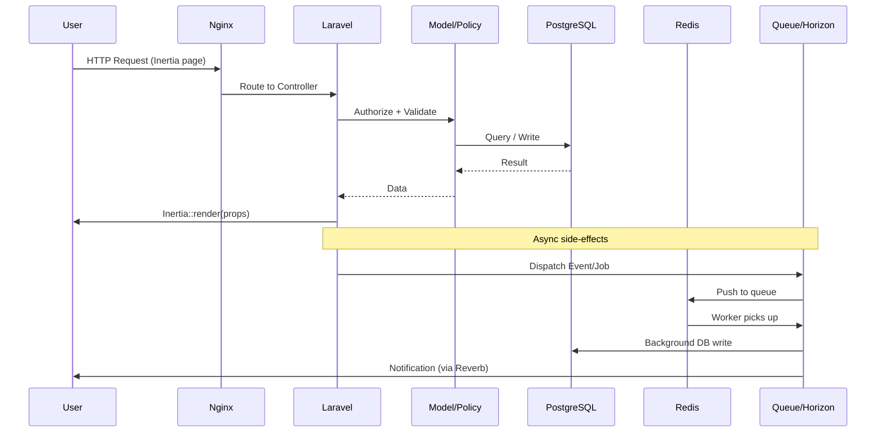
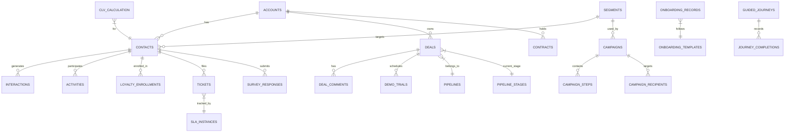

# Full-Stack CRM Application Specifications
## Laravel — Enterprise Architecture Aligned
**Derived from Digital Capability Canvas (Neo4j Cypher Model)**

---

## 1. Executive Summary

This document specifies a full-stack CRM application built on Laravel, aligned to the enterprise capability canvas covering 11 digital domains:

| Domain | Relevance to CRM |
|---|---|
| Manage Digital Experience Orchestration | Core CRM — customer lifecycle, interactions, loyalty |
| Manage Digital Service Orchestration | Service delivery, knowledge base, lead conversion |
| Manage Digital Channels | Omni-channel: web, voice, field, self-service kiosks |
| Manage MarCom Orchestration | Campaign management, marketing analytics, unified customer data |
| Manage Digital Intelligence | Customer analytics, CLV, predictive analytics, cognitive AI |
| Manage Digital Backoffice | Finance, HR, procurement, contracts, asset management |
| Manage Digital GPRC | Governance, compliance monitoring, enterprise orientation |
| Manage Digital Security | IAM, data protection, endpoint security, SOC |
| Manage Digital IT | Platform lifecycle, data lifecycle, infrastructure |
| Manage Digital Interoperability & Automation | API gateway, RPA, middleware, blockchain |
| Manage Digital Workspace | Collaboration, e-signature, digital workspace governance |

---

## 2. Technology Stack

### Backend
- **Framework:** Laravel 11.x (PHP 8.3+)
- **Database:** PostgreSQL 16 (primary via Supabase or self-hosted), SQLite (local fallback)
- **Cache/Queue/Session:** Redis 7 (Upstash or self-hosted)
- **Search:** Laravel Scout + Meilisearch
- **Storage:** Laravel Storage (S3-compatible via MinIO/Supabase)
- **Auth:** Laravel Sanctum (API tokens) + Spatie Permission (RBAC)
- **Real-time:** Laravel Reverb (WebSockets)
- **Job Processing:** Laravel Horizon
- **Media:** Spatie Media Library
- **Audit:** Spatie Activity Log
- **PDF:** Barryvdh DomPDF

### Frontend
- **Framework:** Vue 3 + TypeScript
- **Meta-framework:** Inertia.js v1 (server-driven SPA without separate API layer)
- **UI:** Tailwind CSS + shadcn-vue components
- **Icons:** Lucide Vue Next
- **State:** Pinia (implicit via Inertia shared props)
- **Build:** Vite

### Infrastructure
- **Containerization:** Docker + Docker Compose (app, pgsql, redis)
- **Local Dev:** Laravel Sail (PHP 8.4) or custom Docker
- **Web Server:** Nginx + PHP-FPM (production)
- **Process:** Supervisor (nginx, php-fpm, horizon, scheduler)
- **Deployment:** Render (monolith) or any PHP host with Postgres + Redis

### Architecture Diagram



### Request Flow



### Data Layer



---

## 3. Database Architecture

### 3.1 Core Entity Models

```
contacts
├── id (ulid)
├── account_id (FK → accounts)
├── first_name, last_name, email, phone
├── type (lead | prospect | customer | partner)
├── psychographic_segment_id (FK)
├── demographic_segment_id (FK)
├── status (active | inactive | churned | reactivated)
├── source (web | voice | field | kiosk | social | referral)
├── owner_id (FK → users)
├── clv_score (decimal)
├── loyalty_tier (bronze | silver | gold | platinum)
├── preferred_channel (web | email | sms | phone | in-app)
└── timestamps, soft_deletes

accounts (organizations)
├── id, name, type, industry, size
├── parent_account_id (self-referencing, for subsidiaries)
├── annual_revenue, employee_count
├── billing_address, shipping_address
├── account_manager_id (FK → users)
└── timestamps, soft_deletes

deals (opportunities)
├── id, title, account_id, contact_id
├── stage (qualification | demo | proposal | negotiation | closed_won | closed_lost)
├── value (decimal), currency
├── probability (0-100)
├── expected_close_date
├── pipeline_id (FK → pipelines)
├── owner_id (FK → users)
└── timestamps, soft_deletes

interactions
├── id, contact_id, account_id, deal_id (nullable)
├── type (call | email | meeting | chat | sms | kiosk | field_visit)
├── channel_id (FK → channels)
├── direction (inbound | outbound)
├── subject, body, duration_seconds
├── outcome (positive | neutral | negative | follow_up_required)
├── agent_id (FK → users)
└── timestamps

activities (tasks/follow-ups)
├── id, subject, type (call | email | task | meeting)
├── due_at, completed_at
├── contact_id, deal_id, account_id
├── assigned_to (FK → users)
├── priority (low | medium | high | urgent)
└── timestamps, soft_deletes

segments
├── id, name, type (demographic | psychographic | behavioral | geographic)
├── criteria (JSON — filter rules for dynamic segments)
├── contact_count (cached)
└── timestamps

campaigns
├── id, name, type (email | sms | push | in-app | multi-channel)
├── status (draft | scheduled | active | paused | completed)
├── segment_id, template_id
├── scheduled_at, sent_at
├── budget, spent
├── metrics (JSON — opens, clicks, conversions, revenue)
└── timestamps

products_catalogue
├── id, name, sku, category_id
├── description, price, currency
├── product_data (JSON — unified product data)
└── timestamps

contracts
├── id, title, account_id, contact_id
├── type, status (draft | active | expired | terminated)
├── value, start_date, end_date
├── document_path (S3 key), e_signature_status
├── template_id (FK → contract_templates)
└── timestamps, soft_deletes

tickets (support)
├── id, subject, description
├── contact_id, account_id
├── priority, status (open | in_progress | resolved | closed)
├── category_id, assigned_to
├── sla_breached_at, resolved_at
└── timestamps, soft_deletes

knowledge_base_articles
├── id, title, slug, body
├── category_id, author_id
├── status (draft | published | archived)
├── view_count, helpful_votes
└── timestamps, soft_deletes

audit_logs
├── id, user_id, model_type, model_id
├── event (created | updated | deleted | viewed | exported)
├── old_values (JSON), new_values (JSON)
├── ip_address, user_agent
└── created_at

```

### 3.2 Supporting Tables

```
users, roles, permissions (Spatie Laravel Permission)
teams, team_members
pipelines, pipeline_stages
channels (web | mobile | voice | field | kiosk | social)
contact_segments (pivot)
email_templates, sms_templates
loyalty_programs, loyalty_transactions
webhooks, webhook_deliveries
integrations, integration_configs
notification_preferences
tags, taggables (polymorphic)
custom_fields, custom_field_values
```

---

## 4. Module Specifications

### 4.1 Contact & Account Management
**Capability Mapping:** Manage Stakeholder Segments → Manage Demographic/Psychographic Segmentation

**Features:**
- Full CRUD for contacts and accounts with custom fields
- Dynamic segmentation engine (build segments by rules: demographics, behavior, CLV score, geography)
- Duplicate detection and merge workflow
- Contact timeline (all interactions, activities, deals, tickets in chronological order)
- Bulk import/export (CSV, Excel) with field mapping
- Contact scoring model (customizable rules → numeric score)
- Relationship mapping: contacts ↔ accounts ↔ deals ↔ tickets

**API Routes:**
```
GET|POST /api/contacts
GET|PUT|DELETE /api/contacts/{id}
GET /api/contacts/{id}/timeline
POST /api/contacts/import
GET|POST /api/accounts
GET /api/accounts/{id}/contacts
GET|POST /api/segments
POST /api/segments/{id}/contacts/preview
```

---

### 4.2 Sales Pipeline & Deal Management
**Capability Mapping:** Manage Prospect Conversion, Manage Lead Conversion, Manage Digital Fulfilment

**Features:**
- Multiple configurable pipelines (e.g., New Business, Renewal, Upsell)
- Drag-and-drop Kanban board per pipeline (Vue/Livewire real-time)
- Deal stage automations: auto-assign tasks, send emails, trigger webhooks on stage change
- Probability weighting per stage, weighted revenue forecasting
- Win/loss reasons capture
- Activity logging attached to deals
- Quote/proposal generation (PDF export via DomPDF/Snappy)
- Deal collaboration: multiple team members, comments, @mentions
- Demo & trial management (from Manage Targeted Demos & Trials)

**Current implementation status:**
- **Built:** migrations, Eloquent models, API controllers, services, jobs, events, and translation files for interactions/omni-channel, loyalty/CLV, and deal-stage move.
- **In progress:** admin web controllers and Vue page stubs for these modules (route registration exists, pages are placeholder).
- **Missing:** frontend pages and web controller methods for quote workflows, custom fields, admin campaign builder UI pages, and task completion flows.

**API routes:** defined under `/api/v1` for contacts, accounts, segments, deals, pipelines, interactions, chat, kiosk, integrations, surveys, SLA, onboarding, guided journeys, reactivation, CLV analytics, campaign analytics, loyalty, and translations.

**Admins:** admin web routes exist, but corresponding Vue pages are stubs for many sections. Web controllers exist for Pipelines, Win/Loss Reasons, Quote Templates, Scoring Rules, Campaigns, Campaign Templates, Drip Sequences, and Social Posts.

**Status summary:**
- ✅ Core models + migrations + API layer
- ✅ Reverb events, Horizon jobs, and supporting services
- ✅ Loyalty/CLV tables and API controllers
- ✅ Interactions/admin UI registration and placeholder pages
- ⏳ Full admin UI work remains for several sections

**Automation Example:**
```php
// When deal moves stage -> dispatch event -> listeners/jobs update activity
DealStageMoved::class => Queue backend via Horizon
```

---

### 4.3 Customer Interactions & Omni-Channel
**Capability Mapping:** Manage Customer Interactions, Manage Omni-Channel Delivery, Manage Contact Centers, Manage IVR Interactions, Manage Voice Channels, Manage Self-Service Kiosks

**Features:**
- Unified interaction inbox (email, call logs, chat, SMS, in-person all in one feed)
- Email integration (IMAP/SMTP via Laravel Mail + Mailbox package) — inbound email auto-links to contact
- Call logging: manual or CTI integration (Twilio/Vonage webhooks)
- Live chat widget (Laravel Reverb WebSocket channel)
- SMS via Twilio/Africa's Talking API (Kenya-market relevant)
- IVR call transcript ingestion and linking to contact
- Field channel: mobile field agent app integration (offline-capable API)
- Kiosk interaction events ingestion (REST endpoint for kiosk systems)
- Contact center queue stats dashboard (real-time via WebSockets)
- Multilingual agent interface support (i18n: EN, SW at minimum)

---

### 4.4 Marketing & Campaign Orchestration
**Capability Mapping:** Manage Campaign Optimisation, Manage Campaign Governance, Manage Digital Marketing Awareness/Conversion, Manage MarCom Analytics, Manage Unified Customer Data, Manage Stakeholder Outreach

**Features:**
- Campaign builder with drag-and-drop email template editor
- Multi-channel campaigns: email → SMS → push → in-app sequences
- Segment targeting with real-time count preview
- A/B testing: subject lines, content variants, send-time variants
- Campaign schedule and throttle control
- Automated drip sequences (workflow builder: trigger → condition → action)
- Unified tag management (UTM tracking, custom tags)
- Campaign analytics: open rate, CTR, conversion, revenue attributed
- Mobile marketing & advertising management
- Social media post scheduling (basic: LinkedIn, X, Facebook)
- Content lifecycle management (draft → review → publish → archive)
- Influencer/affiliate tracking stubs

---

### 4.5 Customer Experience & Loyalty
**Capability Mapping:** Manage Stakeholder Loyalty, Manage Customer Incentives, Manage Customer Advocacy, Manage Customer Reactivation, Manage Experience Growth Analytics, Manage CLV Analytics, Manage Customer Onboarding, Manage Self Service

**Features:**
- Loyalty program configuration (tiers, points rules, redemption rules)
- Points ledger per contact, automated tier upgrades/downgrades
- Customer incentive communications (automated loyalty emails/SMS)
- NPS / CSAT survey engine (Manage Voice of Customer)
- Customer expectation management: SLA definitions visible to customers
- Onboarding workflows: checklist of steps, automated welcome sequences
- Self-service portal: contact can view interactions, tickets, documents, loyalty balance
- Guided self-service journeys (step-by-step flows e.g., "How to update billing")
- Reactivation campaigns: auto-trigger for contacts inactive > N days
- Community engagement tracking (forums, referrals)
- CLV analytics module: historical CLV, predicted LTV, cohort analysis

---

### 4.6 Customer Support & Service
**Capability Mapping:** Manage Support Services, Manage Knowledge Base, Manage Voice of Customer, Manage Service Delivery

**Features:**
- Ticket management: create, assign, escalate, resolve, close
- SLA engine: business hours aware, breach alerts, automated escalation
- Support categories, custom forms per category
- Knowledge base: rich-text articles, categories, search (Scout + Meilisearch)
- Internal notes on tickets (agent-only)
- Customer satisfaction rating post-ticket resolution
- Agent performance dashboard: resolution time, CSAT, ticket volume
- Canned responses library
- Ticket merge, split, relate
- Email-to-ticket (inbound email creates/updates tickets)

---

### 4.7 Analytics & Intelligence
**Capability Mapping:** Manage Descriptive Analytics, Manage Diagnostic Analytics, Manage Customer Analytics, Manage Growth Analytics, Manage Finance Analytics, Manage Digital MarCom Analytics, Manage Compliance Intelligence (GRC), Manage Cognitive Intelligence

**Features:**
- CRM dashboard: pipeline value, activity counts, revenue, deal win rate
- Sales forecasting (weighted pipeline, historical win-rate model)
- Customer analytics: segment performance, cohort retention, churn risk score
- Growth analytics: lead conversion metrics, CAC, LTV:CAC ratio
- Finance analytics: revenue by product, revenue allocation, AR aging
- MarCom analytics: campaign ROI, channel attribution, mobile analytics
- Compliance / GRC intelligence: audit trail reports, access anomaly detection
- Predictive deal scoring (rule-based ML proxy, can integrate Python microservice)
- Exploratory analysis: ad-hoc filter/group/export on any entity
- Report builder: save custom report definitions, schedule email delivery
- Executive dashboards (role-specific views)

---

### 4.8 Contracts & Legal
**Capability Mapping:** Manage Contract Lifecycle, Manage Contract Repository, Manage Contract Template & Clause Library, Manage Contract Performance Tracking, Manage Legal Matters

**Features:**
- Contract template library with clause management (rich text, variables)
- Contract generation from template (auto-fill contact/account/deal data)
- PDF generation and storage (S3)
- E-signature workflow (DocuSign/HelloSign integration or built-in OTP-based signing)
- Contract status lifecycle: Draft → Sent → Signed → Active → Expiring → Expired
- Renewal reminders (scheduled notifications 90/60/30 days before expiry)
- Contract performance tracking: milestone dates, KPI fields
- Contract repository: searchable, filterable, downloadable
- Legal matter log (case notes, linked to contacts/accounts)

---

### 4.9 Back-Office & Finance
**Capability Mapping:** Manage Finance Accounting, Manage Revenue, Manage Treasury, Manage Procurement, Manage Vendor Management, Manage Asset Inventory, Manage Human Resources

**Features:**
- Revenue tracking: invoices linked to deals/accounts, payment status
- Ledger summary per account (money in/out)
- Procurement: purchase order creation and vendor assignment
- Vendor management: vendor profiles, performance ratings, vendor requests
- Asset inventory: asset records, stock levels, asset assignments
- Basic HR module: employee directory, headcount planning integration
- Banking relationship notes (treasury management stubs)
- Financial analytics dashboard (revenue allocation, P&L summary)
- Integration hooks to accounting systems (QuickBooks, Sage, Xero via webhooks/API)

---

### 4.10 Security & Access Control
**Capability Mapping:** Manage Identity & Access, Manage Privilege Identity & Access Administration, Manage Data Protection & Privacy, Manage Security Controls, Manage Application Security, Manage Security Event Logging

**Features:**
- Role-Based Access Control (Spatie Laravel Permission): Admin, Manager, Agent, Read-Only, API Client
- Multi-Factor Authentication (TOTP via `pragmarx/google2fa-laravel`)
- Single Sign-On (OAuth2/SAML — configurable, Google Workspace / Azure AD)
- Privileged session management: sudo-mode for destructive operations
- Data classification: field-level sensitivity tags (PII, financial, confidential)
- GDPR/PDPA compliance: right to erasure (soft-delete + anonymization command), data export, consent tracking
- Field-level audit trail for sensitive fields (email, phone, financial data)
- Security event logging: login attempts, privilege changes, bulk exports → `audit_logs`
- Rate limiting on API endpoints (Laravel rate limiter)
- Input sanitization, XSS protection (Laravel Blade auto-escaping, DOMPurify on frontend)
- CSRF protection (Laravel default)
- Encrypted storage for sensitive configuration (Laravel `encrypt()`)
- Password policy enforcement (min length, complexity, history)

---

### 4.11 API & Integrations
**Capability Mapping:** Manage API Lifecycle, Manage API Gateway, Manage API Developer Portal, Manage API Security & Access, Manage Adaptors & Transports, Manage Interoperability Governance

**Features:**
- RESTful API (versioned: `/api/v1/`)
- API authentication: Bearer tokens (Sanctum), API key header
- OAuth2 server for third-party integrations (`laravel/passport`)
- Webhook system: configurable outbound webhooks per event type, retry with exponential backoff, delivery log
- Inbound webhook receivers: Stripe, Twilio, email providers, social platforms
- Integration marketplace stubs: pre-built connectors for Mailchimp, Slack, QuickBooks, Xero, Salesforce (importable)
- API rate limiting per client
- OpenAPI 3.0 documentation auto-generated (Scribe)
- API service registry: catalog of all registered integrations
- Event bus / queue: all integrations fire through Laravel queues (no blocking requests)

---

### 4.12 Workspace & Collaboration
**Capability Mapping:** Manage Collaboration Resources, Manage Digital Workspace Orchestration, Manage E-Signature, Manage Discussion Boards

**Features:**
- Internal notes and comments on any entity (polymorphic)
- @mention notifications (in-app + email)
- Team management: assign agents to teams, team-level reporting
- Activity feed per team
- File attachments (up to 25MB, stored S3) on contacts, deals, tickets, accounts
- E-signature requests from within the CRM (DocuSign API or built-in)
- Internal discussion boards per account or deal (threaded)
- Shared calendar: activities/meetings visible across team
- Notification centre (in-app): real-time WebSocket push, preference management

---

## 5. Laravel Application Structure

```
app/
├── Http/
│   ├── Controllers/
│   │   ├── Api/V1/
│   │   │   ├── ContactController.php
│   │   │   ├── AccountController.php
│   │   │   ├── DealController.php
│   │   │   ├── CampaignController.php
│   │   │   ├── TicketController.php
│   │   │   ├── ContractController.php
│   │   │   ├── AnalyticsController.php
│   │   │   └── WebhookController.php
│   │   └── Web/
│   │       ├── DashboardController.php
│   │       └── ... (Inertia page controllers)
│   ├── Middleware/
│   │   ├── CheckPermission.php
│   │   ├── AuditRequest.php
│   │   └── RateLimit.php
│   └── Requests/ (Form Request validation classes per entity)
│
├── Models/
│   ├── Contact.php, Account.php, Deal.php
│   ├── Interaction.php, Activity.php
│   ├── Campaign.php, CampaignAnalytics.php
│   ├── Ticket.php, KnowledgeBaseArticle.php
│   ├── Contract.php, ContractTemplate.php
│   ├── LoyaltyProgram.php, LoyaltyTransaction.php
│   ├── AuditLog.php, Integration.php
│   └── Webhook.php
│
├── Services/
│   ├── ContactSegmentationService.php
│   ├── CampaignDispatchService.php
│   ├── ScoringService.php           // CLV, deal score
│   ├── SlaService.php
│   ├── AnalyticsService.php
│   ├── ContractService.php
│   ├── WebhookService.php
│   ├── ESignatureService.php
│   └── NotificationService.php
│
├── Events/ + Listeners/
│   ├── DealStageChanged → [CreateFollowUpTask, TriggerWebhook, NotifyTeam]
│   ├── ContactCreated → [AssignSegments, TriggerOnboardingSequence]
│   ├── TicketSlaBreached → [EscalateTicket, NotifyManager]
│   ├── ContractExpiring → [SendRenewalReminder]
│   └── CampaignSent → [UpdateAnalytics]
│
├── Jobs/ (queued)
│   ├── SendCampaignBatch.php
│   ├── ProcessInboundEmail.php
│   ├── DeliverWebhook.php
│   ├── SyncContactFromIntegration.php
│   ├── GenerateContactExport.php
│   └── CalculateClvScores.php
│
├── Policies/ (one per major model)
│   └── ContactPolicy.php, DealPolicy.php, etc.
│
├── Observers/
│   └── DealObserver.php, ContactObserver.php (audit trail triggers)
│
└── Console/Commands/
    ├── ProcessSlaBreaches.php       // runs every 15 min
    ├── SendScheduledCampaigns.php   // runs every minute
    ├── RefreshSegmentCounts.php     // hourly
    └── AnonymizeDeletedContacts.php // daily (GDPR)
```

---

## 6. Key Laravel Packages

```json
{
  "require": {
    "php": "^8.3",
    "laravel/framework": "^13.8",
    "laravel/sanctum": "^4.3",
    "laravel/horizon": "^5.47",
    "laravel/reverb": "^1.10",
    "laravel/scout": "^11.2",
    "spatie/laravel-permission": "^8.0",
    "spatie/laravel-activitylog": "^5.0",
    "spatie/laravel-medialibrary": "^11.23",
    "spatie/laravel-query-builder": "^7.3",
    "inertiajs/inertia-laravel": "^3.1",
    "tightenco/ziggy": "^2.6",
    "barryvdh/laravel-dompdf": "^2.0",
    "maatwebsite/excel": "^3.1"
  },
  "require-dev": {
    "pestphp/pest": "^2.0",
    "pestphp/pest-plugin-laravel": "^2.0",
    "laravel/dusk": "^8.0",
    "fakerphp/faker": "^1.23"
  }
}
```

---

## 7. API Design (Sample Endpoints)

### Contacts
```
GET    /api/v1/contacts                    # List with filters, pagination, sorting
POST   /api/v1/contacts                    # Create contact
GET    /api/v1/contacts/{id}               # Get contact details
PUT    /api/v1/contacts/{id}               # Update contact
DELETE /api/v1/contacts/{id}               # Soft delete
GET    /api/v1/contacts/{id}/timeline      # Full activity/interaction history
GET    /api/v1/contacts/{id}/deals         # Associated deals
GET    /api/v1/contacts/{id}/tickets       # Associated tickets
POST   /api/v1/contacts/import             # Bulk CSV import (async job)
GET    /api/v1/contacts/export             # Export (async, returns download URL)
```

### Deals
```
GET    /api/v1/deals                       # With pipeline/stage filters
POST   /api/v1/deals                       # Create
PATCH  /api/v1/deals/{id}/stage            # Move stage (triggers automation)
GET    /api/v1/pipelines                   # List pipelines
GET    /api/v1/pipelines/{id}/board        # Kanban data
GET    /api/v1/analytics/forecast          # Weighted revenue forecast
```

### Analytics
```
GET    /api/v1/analytics/dashboard         # KPIs for authenticated user's scope
GET    /api/v1/analytics/clv               # CLV analytics
GET    /api/v1/analytics/pipeline          # Pipeline conversion funnel
GET    /api/v1/analytics/campaigns         # Campaign performance summary
GET    /api/v1/analytics/support           # Ticket/SLA metrics
GET    /api/v1/reports                     # Saved reports list
POST   /api/v1/reports                     # Create saved report
POST   /api/v1/reports/{id}/run            # Execute and return data
```

### Webhooks
```
POST   /api/v1/webhooks                    # Register outbound webhook
GET    /api/v1/webhooks                    # List webhooks
DELETE /api/v1/webhooks/{id}
GET    /api/v1/webhooks/{id}/deliveries    # Delivery log
POST   /inbound/email                      # Inbound email receiver (no auth, HMAC verified)
POST   /inbound/twilio                     # Twilio call/SMS webhook
```

---

## 8. Security Architecture

### Authentication Flow
```
Web:  Laravel Fortify → session → RBAC (Spatie) → Policy checks
API:  Bearer token (Sanctum) → token abilities → RBAC → Policy checks
SSO:  Socialite (Google/Azure) → map to internal user → session/token
MFA:  TOTP (Google2FA) enforced for admin/manager roles; optional for agents
```

### Data Security
- Sensitive fields (`email`, `phone`, `national_id`) encrypted at rest using `encrypted:` cast
- HTTPS enforced (HSTS header middleware)
- SQL injection prevention: Eloquent ORM / query builder parameterized queries
- Mass assignment protection: all models use `$fillable` or `$guarded`
- File uploads: validated MIME type, virus scan stub, stored outside web root

### Audit Trail
Every create/update/delete on Contact, Account, Deal, Contract, User, Permission is captured by `spatie/laravel-activitylog` → `audit_logs` table. Exportable per entity or user. Retained for 7 years (configurable retention policy command).

### GDPR/PDPA Compliance
- Data Subject Request module: download all data for a contact, anonymize/delete
- Consent fields on contact: `marketing_consent`, `data_processing_consent`, `consent_timestamp`
- Right to be forgotten: `AnonymizeDeletedContacts` command replaces PII with hash
- Data processing agreement management (stub) linked to accounts

---

## 9. Performance & Scalability

### Caching Strategy
```php
// Contact counts per segment: cache 1 hour
Cache::remember("segment:{$id}:count", 3600, fn() => ...);

// Dashboard KPIs: cache 15 minutes per user
Cache::remember("dashboard:{$userId}", 900, fn() => ...);

// Pipeline board: cache 5 minutes per pipeline
Cache::remember("pipeline:{$id}:board", 300, fn() => ...);
```

### Queue Architecture (Laravel Horizon)
```
default      → general tasks (email send, notifications)
campaigns    → bulk campaign dispatches (high volume, lower priority)
integrations → webhook delivery, sync jobs (isolated failure domain)
analytics    → heavy calculation jobs (CLV, forecasting)
imports      → CSV import processing (I/O bound, concurrency controlled)
```

### Database Optimization
- Indexes: all foreign keys, `status`, `type`, `owner_id`, `created_at` on high-query tables
- `contacts.email` unique index with soft-delete awareness
- Composite index on `(account_id, status, created_at)` for account queries
- Read replicas for analytics queries (configurable via `DB::connection('analytics')`)
- Database query logging in non-production for N+1 detection (Laravel Debugbar/Telescope)

---

## 10. Integration Architecture

### Outbound Integrations (Event-driven)
```
CRM Event → Laravel Event → Queued Job → Integration Service → External API
                                       ↓
                               Webhook Delivery Log (retry on failure)
```

### Key Integration Points

| System | Direction | Method |
|---|---|---|
| Email provider (Mailgun/Postmark) | Outbound | SMTP/API |
| Inbound email parsing | Inbound | IMAP polling / webhook |
| Twilio (SMS/Voice) | Bi-directional | REST API + webhook |
| Africa's Talking (SMS/USSD) | Outbound | REST API |
| DocuSign / HelloSign | Outbound | REST API |
| Accounting (Xero, Sage, QuickBooks) | Bi-directional | REST API (OAuth2) |
| Slack | Outbound | Incoming Webhooks |
| Google Workspace / Azure AD | Inbound (SSO) | OAuth2 / SAML |
| Customer data platforms | Bi-directional | Webhook + REST |
| Analytics tools (GA4, Mixpanel) | Outbound | HTTP pixel / API |

### API Gateway (Internal)
Single entry point for all external API calls: `app/Services/HttpClientService.php`
- Central timeout, retry, and logging config
- Circuit breaker pattern for critical integrations
- Response caching for read-heavy third-party calls

---

## 11. Frontend Architecture (Inertia.js + Vue 3)

### Page Structure
```
resources/js/
├── Pages/
│   ├── Dashboard/Index.vue
│   ├── Contacts/
│   │   ├── Index.vue      (list with filters)
│   │   ├── Show.vue       (contact detail + timeline)
│   │   └── Form.vue       (create/edit)
│   ├── Deals/
│   │   ├── Board.vue      (Kanban)
│   │   └── Show.vue
│   ├── Campaigns/
│   │   ├── Index.vue
│   │   ├── Builder.vue    (email/SMS builder)
│   │   └── Analytics.vue
│   ├── Support/
│   │   ├── Tickets/Index.vue
│   │   └── KnowledgeBase/Index.vue
│   ├── Analytics/
│   │   └── Dashboard.vue
│   ├── Settings/
│   │   ├── Users.vue
│   │   ├── Integrations.vue
│   │   └── Security.vue
│   └── Auth/
│       ├── Login.vue
│       └── TwoFactor.vue
│
├── Components/
│   ├── CRM/
│   │   ├── ContactCard.vue
│   │   ├── DealKanbanCard.vue
│   │   ├── InteractionTimeline.vue
│   │   └── ActivityFeed.vue
│   ├── Charts/
│   │   ├── PipelineFunnel.vue
│   │   ├── ClvChart.vue
│   │   └── CampaignMetrics.vue
│   └── UI/ (Button, Modal, Table, Badge, etc.)
│
└── Layouts/
    ├── AppLayout.vue    (authenticated shell, sidebar, notifications)
    └── AuthLayout.vue
```

### Real-time Features (Laravel Reverb)
```javascript
// Deal board: live updates when a deal is moved by another agent
window.Echo.private(`pipeline.${pipelineId}`)
  .listen('DealStageMoved', (e) => { updateBoard(e.deal) });

// Notification bell
window.Echo.private(`user.${userId}`)
  .listen('NewNotification', (e) => { addToNotificationCentre(e) });

// Support ticket: agent-to-agent handoff notification
window.Echo.private(`team.${teamId}`)
  .listen('TicketAssigned', (e) => { refreshTicketList() });
```

---

## 12. Deployment Architecture

```
┌──────────────────────────────────────────────────────────┐
│                    Load Balancer (Nginx)                   │
└──────────┬───────────────────────────────────────────────┘
           │
    ┌──────┴──────┐
    │ App Servers  │  (Laravel FPM, N instances)
    │ (Docker)     │
    └──────┬──────┘
           │
    ┌──────┴──────────────────────────────┐
    │                                      │
    ▼                                      ▼
┌─────────┐    ┌──────────┐    ┌────────────────┐
│ MySQL   │    │  Redis   │    │  Meilisearch   │
│ Primary │    │ (cache/  │    │  (full-text    │
│+ Replica│    │  queues) │    │   search)      │
└─────────┘    └──────────┘    └────────────────┘
                    │
              ┌─────┴─────┐
              │  Horizon  │   (Queue workers)
              │ Workers   │
              └───────────┘

Storage: AWS S3 (documents, exports, media)
Reverb:  WebSocket server (separate container)
Scheduler: Single cron container → `php artisan schedule:run`
```

---

## 13. Testing Strategy

### Unit Tests (Pest)
- All Service classes: `ContactSegmentationService`, `SlaService`, `ScoringService`
- All Policy classes: ensure correct permission gates
- All Observer/Listener logic

### Feature Tests (Pest + Laravel HTTP testing)
- Full CRUD API for each resource (auth, validation, response shape)
- Campaign dispatch flow (including queue job execution)
- Webhook delivery (mock HTTP, assert retry logic)
- SLA breach detection and escalation
- Import/export (CSV parsing, queue processing)
- GDPR anonymization command

### Browser Tests (Dusk)
- Login + MFA flow
- Deal drag-and-drop stage move
- Campaign builder: create, send, view analytics
- Contact import wizard

### Coverage Target: ≥ 80% on Services and Controllers

---

## 14. Configuration & Environment Variables

```env
# App
APP_NAME="Enterprise CRM"
APP_URL=https://crm.yourdomain.com

# Database
DB_CONNECTION=mysql
DB_HOST=db
DB_PORT=3306
DB_DATABASE=crm_prod
DB_PASSWORD=...

# Redis
REDIS_HOST=redis
REDIS_PORT=6379
QUEUE_CONNECTION=redis
CACHE_STORE=redis

# Storage
FILESYSTEM_DISK=s3
AWS_BUCKET=crm-files
AWS_DEFAULT_REGION=af-south-1    # or us-east-1

# Search
SCOUT_DRIVER=meilisearch
MEILISEARCH_HOST=http://meilisearch:7700

# Mail
MAIL_MAILER=postmark
POSTMARK_TOKEN=...

# SMS
TWILIO_ACCOUNT_SID=...
TWILIO_AUTH_TOKEN=...
AFRICAS_TALKING_API_KEY=...     # Kenya market

# E-Signature
DOCUSIGN_INTEGRATION_KEY=...

# WebSockets
REVERB_APP_ID=...
REVERB_APP_KEY=...
REVERB_APP_SECRET=...

# Security
SESSION_LIFETIME=480
MFA_REQUIRED_ROLES=admin,manager

# Integrations
XERO_CLIENT_ID=...
QUICKBOOKS_CLIENT_ID=...
SLACK_WEBHOOK_URL=...
```

---

## 15. Roadmap Phases

| Phase | Duration | Scope |
|---|---|---|
| **Phase 1 — Core CRM** | 8 weeks | Contacts, Accounts, Deals, Activities, Basic Interactions, Auth/RBAC |
| **Phase 2 — Engagement** | 6 weeks | Tickets, Knowledge Base, Campaigns (email/SMS), Loyalty Programs |
| **Phase 3 — Intelligence** | 6 weeks | Analytics dashboards, CLV scoring, Forecasting, Custom Reports |
| **Phase 4 — Integrations** | 4 weeks | Webhooks, API marketplace, Accounting connectors, SSO |
| **Phase 5 — Advanced** | 6 weeks | Contracts/E-sign, Self-service portal, AI lead scoring, Mobile app API |

---

*Document version 1.0 — Derived from Digital Capability Canvas (Neo4j Cypher, 11 domains, 80+ capabilities)*